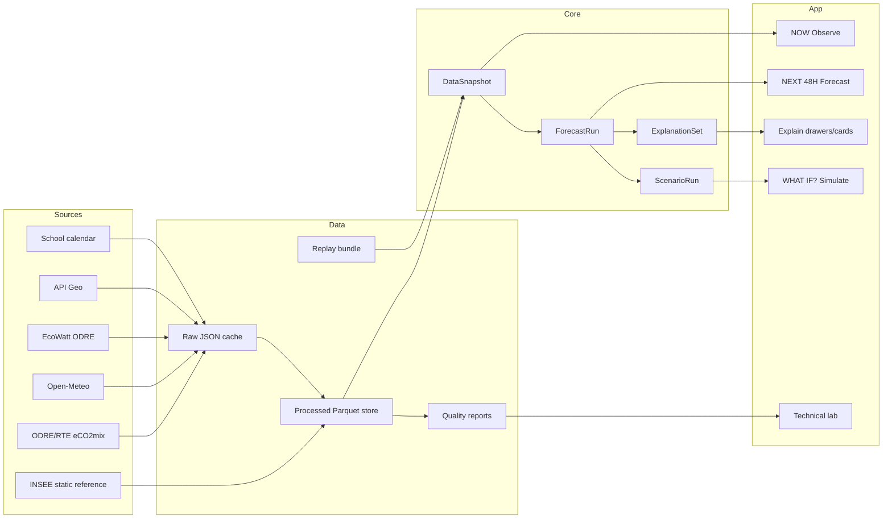

# ADR 0001: Target Architecture for Explainable Electricity-Demand Digital Twin

Date: 2026-06-18

Status: Accepted for implementation planning

## Context

Energy Pulse France is currently a Python/Streamlit prototype with public pages for NOW, NEXT 48H, and WHAT IF?, plus hidden technical pages. It uses public data sources, local file caches, pandas/Parquet processing, Plotly visualizations, pytest, and an experimental scikit-learn demand model pipeline.

The target product flow is:

```text
Observe -> Forecast -> Explain -> Simulate
```

Constraints:

- Use only free, publicly available online data.
- Do not require paid APIs or proprietary datasets.
- Keep mocks in tests or explicitly labelled replay/demo mode.
- Do not broadly rewrite the app or replace the visible product design.
- Do not implement the forecasting model in the audit milestone.

## Decision

Keep the existing Python/Streamlit stack and evolve it through explicit internal contracts. Do not replace it with a separate React/FastAPI architecture unless future scale requirements make that necessary.

Target boundaries:

1. Data source clients remain in `src/data_sources/`.
2. Data processing and quality checks remain in `src/data_processing/`.
3. Forecasting, baselines, explanations, and simulations remain in `src/models/` or typed view-model contracts.
4. Streamlit pages remain in `app/pages/`.
5. Public pages consume stable view models from `app/data_loader.py` and `app/view_models.py`.
6. Durable artifacts remain file-based: raw JSON, processed Parquet, generated JSON, and tracked replay bundles.
7. Repository verification is centralized in `python -m scripts.verify`.

Target contracts:

| Contract | Purpose | Minimum fields |
| --- | --- | --- |
| `DataSnapshot` | Observed/replay state for Observe | timestamp, mode, source, freshness, quality, demand, generation, exchanges, weather, EcoWatt, regional context |
| `ForecastRun` | Forecast output for Forecast | origin, generated_at, horizon, target timestamp, p10, p50, p90, route, route confidence, backtest metrics, fallback reason |
| `ExplanationSet` | Driver output for Explain | forecast/run ID, method, driver cards, technical contributions, caveats, source feature families |
| `ScenarioRun` | Simulation output for Simulate | baseline forecast ID, scenario ID, assumption version, modified time series, deltas, warnings |

Public data policy:

- Required default path: no credentials.
- Optional token-gated integrations may exist only as non-required enhancements.
- Scenario assumptions must cite public sources or be labelled demo-only.

## Architecture Sketch



## Consequences

Positive:

- Preserves the current app and hackathon delivery velocity.
- Avoids unnecessary frontend/backend split.
- Keeps public-demo deployment simple and credential-free.
- Makes replay/live/generated provenance explicit.
- Creates clear boundaries for later model, explainability, and scenario work.

Tradeoffs:

- Streamlit remains stateful and in-process; it is not an API platform.
- File-based artifacts require discipline around schema versions and atomic writes.
- Some quality gates are limited until formatter/linter/type-checker tooling is added.
- The current model and scenario paths must remain labelled experimental/directional until validated.

## Alternatives Considered

### Replace with React plus FastAPI

Rejected for this milestone. It would create a broad rewrite and visible product/design risk without solving the immediate data and explanation gaps.

### Keep hard-coded scenarios indefinitely

Rejected. Hard-coded coefficients are acceptable for explicit replay/demo mode, but the target digital twin needs versioned assumptions with public citations.

### Require token-gated APIs by default

Rejected. The default product must run from free public data without credentials. Optional token-gated enhancements may be supported only when the no-key path remains complete enough for demo and testing.

### Treat demo time-shift as live-like current data

Rejected. Time-shifted data must remain replay/demo and should carry explicit provenance and freshness messaging.

## Implementation Notes

- `APP_MODE=demo` should keep using `demo_data/`, but the public docs and UI must continue to say replay.
- `APP_MODE=live` should prefer official public sources and cache fallbacks, but should not silently inject hard-coded regional replay data as live.
- Forecast points should store route and reason, not just source text.
- Explanations should distinguish model-derived association from causal explanation.
- Scenario runs should reference an assumption artifact with schema version, source notes, and date.
- CI and local development should use `python -m scripts.verify`.

## Open Questions

- Replay mode now uses the fixed historical window in `demo_data/manifest.json` instead of time-shifting to the current day.
- Should optional ENTSO-E token-gated data be allowed for future import/context explanations, given the no-paid-data constraint?
- Which public source should govern scenario coefficients for EV charging, heating sensitivity, and solar/wind availability?
- Should regional simulations remain a visual national-pressure overlay, or wait for region-specific models?
