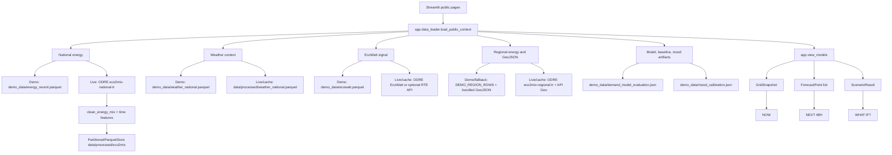

# Current State Audit

Date: 2026-06-18

Scope: audit the existing Energy Pulse France repository for readiness toward an explainable electricity-demand digital twin. No forecasting model was implemented as part of this audit.

## Executive Summary

Energy Pulse France is a Python-first Streamlit application, not a split frontend/backend service. The current public flow is already close to the desired narrative:

1. Observe: `app/pages/now.py`
2. Forecast: `app/pages/next_48h.py`
3. Explain: driver cards, forecast routing text, and hidden technical model pages
4. Simulate: `app/pages/what_if.py`

The stack can support the target architecture without a broad rewrite. The main readiness gaps are data-mode clarity, hard-coded scenario coefficients, fallback forecast behavior, stale CI smoke expectations, and the absence of a production-quality explainable model and calibrated simulation layer.

Verification performed during this audit:

- App smoke, demo mode: passed via Streamlit at `http://127.0.0.1:8561`, then stopped.
- Syntax/build smoke: `python -m compileall -q app src scripts`, passed.
- Test suite: `APP_MODE=demo DEMO_ALLOW_EXTERNAL_API=0 python -m pytest -q`, passed with `88 passed, 2 skipped`.
- CI-style old homepage smoke: documented by the testing sub-agent as stale because it expected pre-router copy.

## Repository Structure and Technologies

| Path | Purpose | Notes |
| --- | --- | --- |
| `app/main.py` | Streamlit application entrypoint | Uses `st.Page` and `st.navigation`; public pages are NOW, NEXT 48H, WHAT IF?. |
| `app/pages/` | Streamlit pages | Public pages plus hidden technical pages for data quality, baselines, historical, demand model, explainability, deployment health. |
| `app/components/` | UI components | Cards, Plotly charts, regional maps, deployment/data-quality panels, energy-weather timeline. |
| `app/data_loader.py` | In-process data orchestration for public pages | Loads demo/live energy, weather, EcoWatt, regional data, GeoJSON, model artifacts. |
| `app/view_models.py` | Public-page view models and scenario logic | Builds snapshots, forecast points, pressure labels, scenario results. |
| `src/data_sources/` | Public data clients | ODRE/RTE eCO2mix, regional eCO2mix, EcoWatt, Open-Meteo, school calendar, API Geo. |
| `src/data_processing/` | Cleaning, validation, quality, storage, feature joining | File-based Parquet partitions and quality reports. |
| `src/models/` | Baselines, demand model, mood calibration, load-shift simulator | Demand model exists but remains experimental. |
| `scripts/` | CLI pipeline commands | Fetching, backfill, features, training, evaluation, quality, demo export, verification. |
| `demo_data/` | Tracked replay bundle | Small offline bundle used by default demo mode. |
| `data/raw/` | Ignored raw API cache | Source-faithful JSON snapshots. |
| `data/processed/` | Ignored processed artifacts | Parquet partitions and generated model artifacts. |
| `tests/` | Pytest suite | Includes Streamlit page smoke tests and model/data tests. |
| `.github/workflows/ci.yml` | GitHub Actions | Normalized to call the repo verification command. |

Technologies:

- Runtime: Python, hosted target `python-3.12` in `runtime.txt`.
- Local observed runtime: `.venv` Python 3.13.2.
- App framework: Streamlit.
- Charts and maps: Plotly Graph Objects and Plotly Express, including `go.Choropleth`.
- Data: pandas, pyarrow Parquet, requests.
- ML dependencies: scikit-learn and numpy in developer requirements.
- Tests: pytest and Streamlit AppTest.
- No JavaScript SPA, REST API server, database, Dockerfile, Makefile, or typed Python configuration was present before this audit.

## Page and Component Inventory

Public pages:

| Page | Route | Purpose | Main data path |
| --- | --- | --- | --- |
| `app/pages/now.py` | `/` | Current national demand, regional map, drivers, generation mix | `load_public_context()` -> `build_grid_snapshot()` -> `build_forecast_points()` |
| `app/pages/next_48h.py` | `/next-48h` | 48-hour public outlook, peak/best window/confidence, selected-hour explanation | `load_public_context()` -> `build_forecast_points()` |
| `app/pages/what_if.py` | `/what-if` | Directional scenario comparison over forecast horizon | `load_public_context()` -> `build_forecast_points()` -> `run_scenario()` |

Hidden technical pages:

- `app/pages/technical_lab.py`: navigation hub.
- `app/pages/1_live_grid.py`: regional live-grid detail.
- `app/pages/4_historical.py`: historical demand and generation.
- `app/pages/5_baselines.py`: baseline backtest artifact viewer.
- `app/pages/6_demand_model.py`: experimental demand model artifact viewer.
- `app/pages/3_explainability.py`: placeholder for future explainability.
- `app/pages/technical_data_quality.py`: public-context data quality view.
- `app/pages/technical_deployment_health.py`: artifact/runtime readiness checks.
- Legacy numbered pages `2_forecast.py` and `7_demand_shifting_simulator.py` still exist; only pages registered by `app/main.py` are in the current navigation.

Shared UI/components:

- `app/components/cards.py`: metric cards, driver cards, status badges, section headers. It uses `unsafe_allow_html=True` but escapes dynamic text through `html.escape` in the reviewed card paths.
- `app/components/public.py`: public-page header, selected-region state, generation mix, forecast chart, waterfall, scenario chart, provenance drawers.
- `app/components/regional_map.py`: Plotly choropleth with optional department outlines.
- `app/components/charts.py`: technical charts and color mappings.
- `app/components/theme.py`: CSS design tokens and Streamlit theme override.
- `app/components/deployment_health.py`, `data_quality.py`, `energy_weather.py`, `weather_context.py`, `mood_explanation.py`: technical and auxiliary panels.

## API Endpoints and State Management

There are no internal HTTP API endpoints. The app is an in-process Streamlit application.

State-management approach:

- Streamlit rerun model.
- `st.cache_data` for data loaders with 900-second TTLs, and 86400 seconds for region GeoJSON.
- `st.session_state["selected_region_code"]` stores selected map/region context.
- File-system artifacts are the durable state: raw JSON, processed Parquet, generated JSON, and tracked demo artifacts.

External endpoint families:

| Source | Repo client | Access | Credentials |
| --- | --- | --- | --- |
| ODRE/RTE eCO2mix national near-live | `src/data_sources/rte_eco2mix.py` | Opendatasoft Explore API v2.1, dataset `eco2mix-national-tr` | No key |
| ODRE/RTE eCO2mix regional near-live | `src/data_sources/rte_eco2mix_regional.py` | Opendatasoft Explore API v2.1, dataset `eco2mix-regional-tr` | No key |
| ODRE/RTE eCO2mix consolidated history | `src/data_sources/rte_eco2mix_historical.py` | Opendatasoft Explore API v2.1, dataset `eco2mix-national-cons-def` | No key |
| Open-Meteo weather | `src/data_sources/weather_national.py`, `weather.py` | Forecast and archive APIs | No key |
| EcoWatt ODRE history | `src/data_sources/ecowatt.py` | ODRE public datasets `nouveau_signal_ecowatt`, `signal-ecowatt` | No key |
| Optional EcoWatt live API | `src/data_sources/ecowatt.py` | RTE live API | Optional bearer token |
| API Geo region boundaries | `src/data_sources/rte_eco2mix_regional.py` | `geo.api.gouv.fr` region GeoJSON | No key |
| School calendar | `src/data_sources/school_calendar.py` | data.education.gouv.fr `fr-en-calendrier-scolaire` | No key |
| City weights | `src/data_sources/fr_major_cities_v1.json` | Static repo reference derived from INSEE population | No runtime key |
| ENTSO-E | `src/data_sources/entsoe.py` | Reserved future integration | Token required; not currently used by app |

## Current Data Flow

Important current behavior:

- Default `APP_MODE` is `demo`; default `DEMO_ALLOW_EXTERNAL_API` is off.
- Demo energy and weather use the fixed historical window in `demo_data/manifest.json` and are labelled replay.
- Live national fetches are cached to `data/raw/rte_eco2mix` and upserted into `data/processed/eco2mix`.
- Live regional fetch failures fall back to cached regional data; if unavailable, they fall back to hard-coded demo regional rows.
- Forecast points prefer fresh validated model points or RTE forecast columns, then fall back to recent comparable-hour rules.

## Charts and Mapping Libraries

- Plotly Graph Objects:
  - `go.Choropleth` for regional maps.
  - `go.Scatter` for forecast and scenario lines.
  - `go.Waterfall` for forecast driver waterfall.
  - `go.Pie` for technical mix donut.
  - `go.Bar` for generation mix.
- Plotly Express:
  - `px.line` and `px.area` for historical/technical charts.
- No Folium, Leaflet, Mapbox, deck.gl, pydeck, or JavaScript mapping framework is currently used.

## Synthetic, Mocked, Generated, or Ambiguous Visible Values

This inventory focuses on values that feed the NOW, NEXT 48H, and WHAT IF? public pages. Test-only synthetic fixtures are intentionally excluded unless they leak into public UI.

| Page | Field or display | Source | Why it is synthetic, generated, or ambiguous | Required action |
| --- | --- | --- | --- | --- |
| All public pages | National demand, generation, CO2, weather in default mode | `demo_data/energy_recent.parquet`, `demo_data/weather_national.parquet` | Historical 2024-12-17 to 2024-12-31 sample is fixed-date replay. | Keep only as explicitly labelled historical replay/demo mode; do not use for live claims. |
| All public pages | `mode` badge | `app/data_loader.py`, `app/components/public.py` | Combined mode becomes REPLAY if either national or regional path is replay. | Keep badge prominent; preserve data provenance drawer. |
| NOW, NEXT 48H, WHAT IF? | Regional demand/generation/CO2 | `DEMO_REGION_ROWS` in `src/data_sources/rte_eco2mix_regional.py` | Hard-coded replay snapshot for 13 regions. | Replace with live/cache regional data for live mode; keep demo-only. |
| NOW, NEXT 48H, WHAT IF? | Regional comparable history and demand anomaly | `synthesize_regional_history()` in `app/view_models.py` | Synthesizes 28 days hourly context, rank-based anomaly target, hour/day factors, and drift. | Mark as replay-only and replace with real historical regional context. |
| NOW, NEXT 48H, WHAT IF? | Regional anomaly score | `add_regional_anomalies()` | Score formula `0.5 + anomaly_pct / 0.36`, clipped 0 to 1. | Document as visualization scaling, not physical pressure. |
| NOW, NEXT 48H, WHAT IF? | Pressure label | `pressure_label()` | Hard-coded thresholds: Comfortable, Normal, Watch, High at availability ratios 0.84, 0.92, 0.98. | Calibrate or label as heuristic until validated. |
| NOW | Weather headline | `_weather_summary()` | Hard-coded thresholds: cold <= 5 C, heat >= 27 C, wind >= 35 km/h, otherwise mild. | Treat as explanatory heuristic. |
| NOW | EcoWatt official card | `demo_data/ecowatt.parquet` has 0 rows | Default demo can show EcoWatt unavailable even when public history exists elsewhere. | Refresh replay bundle or clearly label unavailable. |
| NOW | Selected region default | `selected_region()` | If user has no selection, defaults to the region with highest anomaly score. | Acceptable UI heuristic; document. |
| NEXT 48H | 48-hour forecast points | `build_forecast_points()` | Mix of model/RTE fields and fallback rules; not a full operational forecast. | Split route labels into forecast source classes and quality gates. |
| NEXT 48H | Model forecasts in demo | `_validated_model_points()` | Demo energy and evaluation artifacts share the fixed 2024 replay window; stale or mismatched model points are rejected by the freshness check. | Use a replay-relative model artifact or display route as replay fallback. |
| NEXT 48H | Fallback forecast demand | `_reference_demand()` | Previous-day exact value, same-hour 14-sample median, or last-24-hour mean. | Keep as baseline/fallback only; never call AI. |
| NEXT 48H | Forecast uncertainty band | `build_forecast_points()` | Default error `max(std, mean*0.055, 1800)` and interval multiplier `1.28`. | Replace with evaluated probabilistic intervals in forecasting milestone. |
| NEXT 48H | Static availability | `_latest_availability()` | Latest production/import availability is reused for future pressure. | Add supply availability forecast or label as static-current-supply assumption. |
| NEXT 48H | Unsupported horizons >24h | `build_forecast_points()` | If no official/model point exists, hours after 24h are visible but labelled no recommendation. | Acceptable if clearly displayed; improve with validated model later. |
| NEXT 48H | Flexible demand counterfactual | `app/pages/next_48h.py` | Assumes selected hour demand is 3 percent lower. | Move into explicit scenario engine or label as illustrative. |
| WHAT IF? | Scenario presets | `SCENARIO_PRESETS` | Hard-coded defaults: 3 C cold snap, 2.5 GW low wind, 1.3 GW outage, 100,000 EVs, 1.2 GW solar. | Move coefficients to versioned assumptions with citations. |
| WHAT IF? | Scenario control bounds | `app/pages/what_if.py` | EV 10,000 to 500,000; generic intensity 0.2 to 6.0; cold max 8.0; start hour default 18. | Keep as UI bounds but document and validate. |
| WHAT IF? | Cold snap demand | `run_scenario()` | 950 MW per C, peak factor 1.15, off-peak factor 0.7; carbon +4 g/kWh per C. | Replace with data-derived sensitivity by season/hour. |
| WHAT IF? | Low wind | `run_scenario()` | `intensity * 1000` MW supply loss during 17:00 to 23:00; carbon +12 g/kWh. | Replace with weather-to-wind-generation model or explicit assumption artifact. |
| WHAT IF? | Generation outage | `run_scenario()` | `intensity * 1000` MW supply loss across all hours; carbon +6 g/kWh. | Label as capacity stress, not dispatch. |
| WHAT IF? | EV shift | `run_scenario()` | 8 kWh per EV; subtract evening 18:00 to 21:00 and add overnight 01:00 to 05:00; carbon -4 g/kWh overnight. | Replace with public mobility/charging assumptions or keep demo-only. |
| WHAT IF? | Solar above forecast | `run_scenario()` | `intensity * 1000` MW supply gain during selected daylight window; carbon -10 g/kWh. | Replace with weather/solar generation relationship. |
| WHAT IF? | Carbon baseline | `run_scenario()` | Reads `snapshot.demand["co2_intensity_g_per_kwh"]`, but snapshot does not set it, so fallback 45 g/kWh is used. | Fix in a future implementation milestone; audit documents the bug. |
| WHAT IF? | Carbon change tonnes | `run_scenario()` | Simplified `p50 * carbon_delta / 1000` sum; not verified emissions accounting. | Keep warning and replace with auditable emissions logic if needed. |
| WHAT IF? | Scenario regional map | `scenario_regional_map_frame()` | Applies national demand/supply lift uniformly across regional scores; label appends `-> scenario pressure`. | Replace with region-specific allocation or label as national pressure overlay. |
| All public pages | `demo_data/model_forecast.json` | Demo artifact exists but is not loaded by public pages. | Either remove from required public path or wire it intentionally later. |

Generated artifacts used or visible indirectly:

- `demo_data/demand_model_evaluation.json`: generated model evaluation artifact, trimmed for demo. It is experimental and not an operational forecast.
- `demo_data/baseline_backtest.json`: generated deterministic baseline backtest.
- `demo_data/mood_calibration.json`: generated calibration artifact.
- `demo_data/quality_report.json` and `quality_suspicious_rows.parquet`: generated data-quality evidence.
- `demo_data/manifest.json`: generated replay bundle manifest.

## Technical Debt and Security Risks

| Risk | Impact | Current status |
| --- | --- | --- |
| Stale CI smoke check | CI can fail even when current app/tests pass | Normalized to `python -m scripts.verify`. |
| No configured formatter/linter/type checker | Quality gates depend on compile/test rather than style/type tooling | `scripts.verify` runs built-in gates and optional Ruff/mypy if installed. |
| Demo time rebasing | Replay values can be mistaken for live data | UI labels REPLAY, but docs and provenance must remain explicit. |
| Hard-coded scenario coefficients | Simulations can be overinterpreted | WHAT IF? labels outputs as directional; target needs versioned assumptions. |
| Static future availability | Forecast pressure may understate/overstate supply risk | Needs supply/availability forecast or clear label. |
| Carbon baseline bug in scenario engine | WHAT IF? carbon change starts from fallback 45 g/kWh | Documented as a future fix. |
| Regional demo fallback | Map can show hard-coded regional values if live/cached regional fetch fails | Acceptable in replay only; needs stricter live-mode behavior. |
| `unsafe_allow_html=True` | Potential XSS if unescaped data is inserted | Reviewed card paths escape dynamic values, but continued care is required. |
| Optional tokens in environment | Accidental secret exposure risk if `.env` is committed | `.env.example` is safe; `.env` should remain ignored. |
| Network fetches lack robust backoff/rate limits | Live mode may be brittle under external API failures | Cache fallbacks exist; retry/rate policy should be added. |
| Runtime mismatch | Hosted target is Python 3.12 while local `.venv` is Python 3.13.2 | Tests passed locally, but CI should remain authoritative on 3.12. |
| Generated metadata typo | Some demo artifact metadata references `engie_hackaton` | Low functional risk; clean during artifact refresh. |

## Current Data Source Compliance

The repository already favors free public sources. Paid APIs and proprietary datasets are not required for the current app.

| Data need | Current source | Free public? | Credentials? | Target use |
| --- | --- | --- | --- | --- |
| National observed demand/generation | ODRE/RTE eCO2mix | Yes | No | Primary observe data |
| Regional observed demand/generation | ODRE/RTE regional eCO2mix | Yes | No | Regional observe/explain context |
| Historical demand | ODRE/RTE consolidated eCO2mix | Yes | No | Training and backtesting |
| Weather | Open-Meteo | Yes | No | Forecast features and explanation |
| EcoWatt public signal | ODRE EcoWatt datasets | Yes | No | Official public signal |
| EcoWatt live API | RTE EcoWatt API | Free public-ish but token gated | Optional token | Optional; should not be required |
| Regions geometry | API Geo / bundled simplified GeoJSON | Yes | No | Mapping |
| School holidays | data.education.gouv.fr | Yes | No | Calendar features |
| Population weights | INSEE-derived static reference | Yes | No runtime key | Weather weighting |
| ENTSO-E | ENTSO-E transparency platform | Free registration | Token | Not used; future only if policy allows |

## Target Architecture Summary

Keep the existing Streamlit/Python stack. Introduce clearer internal contracts rather than replacing the product:

- `Observe`: official/replay `DataSnapshot` contract with provenance, freshness, mode, and quality status.
- `Forecast`: evaluated `ForecastRun` contract with origin, horizon, p10/p50/p90, route, backtest metrics, and fallback reason.
- `Explain`: `ExplanationSet` contract with driver contributions, source data, model/fallback status, and plain-language text.
- `Simulate`: `ScenarioRun` contract with versioned public assumptions, baseline run ID, modified run, deltas, and disclaimers.

The detailed architecture decision is in `docs/adr/0001-target-architecture.md`.
