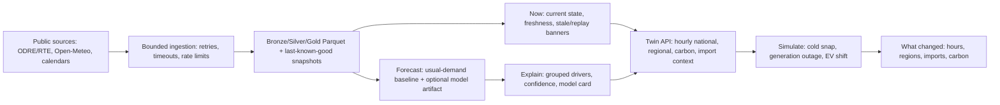

# Energy Pulse France Demo Release Runbook

## Architecture



## Startup And Verification

One startup command:

```powershell
python run_app.py
```

One verification command:

```powershell
python -m scripts.verify
```

Container option:

```powershell
docker build -t energy-pulse-france .
docker run --rm -p 8501:8501 --env APP_MODE=demo --env DEMO_ALLOW_EXTERNAL_API=0 energy-pulse-france
```

Initialize local cache/database directories without network access:

```powershell
python -m scripts.bootstrap
```

Run scheduled ingestion in live mode:

```powershell
$env:APP_MODE="live"
python -m scripts.scheduled_ingestion --interval-seconds 900
```

## Demo Modes

- Live mode: `APP_MODE=live`; refreshes public sources and falls back to processed/raw caches.
- Last-known-good mode: automatic when a live source fails and a usable processed/raw cache exists.
- Historical replay mode: `APP_MODE=demo` and `DEMO_ALLOW_EXTERNAL_API=0`; uses the fixed committed `demo_data/` window and is visibly labelled replay/demo.

The fixed replay bundle currently covers the dates in `demo_data/manifest.json`. Replay values are historical context, not current reality.

## Public Data Attribution

- ODRE/RTE eCO2mix national near-live and consolidated history: public RTE electricity demand, generation, exchange, and CO2 context via ODRE/Opendatasoft.
- ODRE/RTE eCO2mix regional: public regional demand and generation context via ODRE/Opendatasoft.
- Open-Meteo: public weather forecast/archive variables used for context and model features.
- French public holidays and school holidays: public French calendar data used for local-time baselines.
- INSEE population references: city weights for national weather aggregation.

## Model Training

Build features and train the experimental demand model:

```powershell
python -m scripts.build_features
python -m scripts.train_demand_model
python -m scripts.evaluate_demand_model
```

Train the probabilistic residual candidate:

```powershell
python -m scripts.build_usual_demand_dataset
python -m scripts.train_probabilistic_demand_forecast
```

If no champion probabilistic artifact exists, inference uses the documented usual-demand fallback. That fallback is labelled and is not presented as an AI forecast.

## Scenario Assumptions

The scenario engine is deterministic and bounded. It supports:

- Cold snap: demand delta from temperature change, heating sensitivity, local-hour multipliers, and selected scope.
- Generation outage: supply availability reduction, demand unchanged.
- EV charging shift: conserved energy moved from source window to target window.

It does not model AC power flow, dispatch optimization, reserve margins, market clearing, storage, voltage, or congestion. Imports/exports, flexible generation, and carbon are directional ranges.

## API Guide

- `GET /v1/state/current?region=11`
- `GET /v1/data-health`
- `GET /v1/sources`
- `GET /v1/config/status-thresholds`
- `GET /v1/twin?from=<timestamp>&hours=48&region=11`
- `GET /v1/forecast?scope=france&hours=48`
- `GET /v1/model-card`
- `POST /v1/scenarios/run`
- `GET /v1/metrics`

API hardening:

- Request IDs are returned in `X-Request-ID`.
- CORS is restricted by `ENERGY_PULSE_ALLOWED_ORIGINS`.
- JSON scenario bodies are capped by `ENERGY_PULSE_MAX_BODY_BYTES`.
- Unexpected errors return `{"error":"internal_error","request_id":"..."}` without stack traces.

## Troubleshooting

- App cannot load demo: run `python -m scripts.bootstrap` and verify `demo_data/energy_recent.parquet` plus `demo_data/manifest.json`.
- Replay looks old: expected; replay is fixed historical data and is not live.
- Live source unavailable: inspect `/v1/data-health`; the app should show last-known-good or unavailable fields instead of zero-filled values.
- Scenario rejected: check magnitude, duration, assumptions size, and scope. Generator outage supports national scope only.
- Model unavailable: expected on clean checkout; the usual-demand fallback should be labelled.
- Dependency audit unavailable: install `requirements-dev.txt` and rerun `python -m scripts.verify`.

## Known Limitations

- Public-source latency and schema changes remain external risks.
- Regional demand is context inside the connected French grid, not regional adequacy.
- Carbon is separate context and not an official operational signal.
- Scenario outputs are educational sensitivity estimates.
- Demo replay includes fixed historical data; it is deliberately not current reality.

## Three-Minute Demo Script

1. Open **NOW**. Point out the Replay/Demo or Live label, latest timestamp, and official EcoWatt versus modelled balance rows.
2. Explain why demand differs from usual using demand, weather, generation/exchange, and official-signal driver cards.
3. Open **NEXT 48H**, select tomorrow's expected peak, review the p10/p50/p90 range, confidence factors, and driver table.
4. Inspect the future regional map and selected-hour generation, imports, and carbon context.
5. Open **WHAT IF?**, run a cold snap or generation unavailable scenario, then identify changed hours, changed regions when supported, import/export range, generation response, and carbon range.
6. End on the assumptions/limitations panel and `/v1/data-health`: unavailable sources are labelled, replay is distinct from live, and no synthetic value is presented as current reality.
