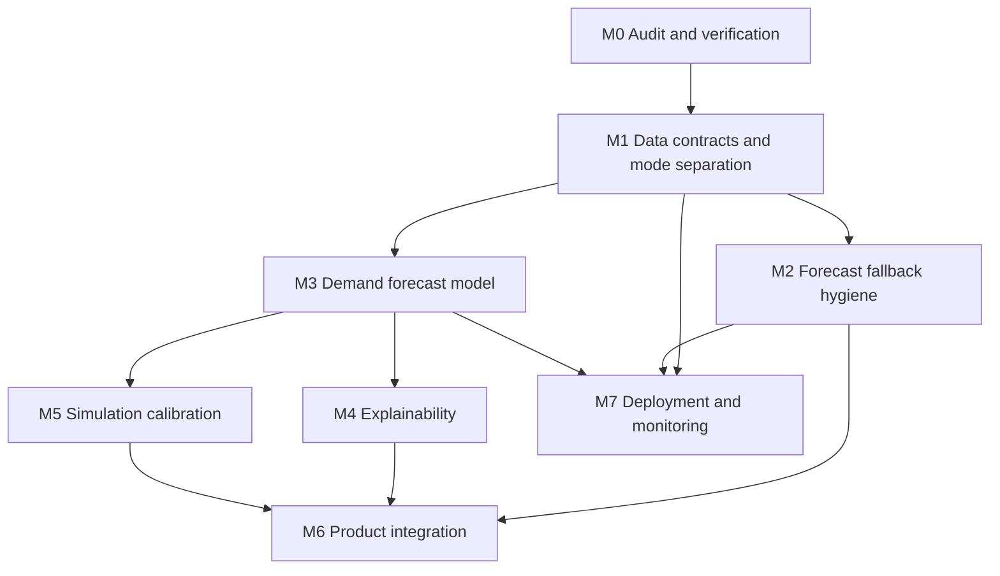

# Implementation Plan

Date: 2026-06-18

Goal: prepare Energy Pulse France for an explainable electricity-demand digital twin using only free, publicly available online data, while adapting the current Streamlit/Python stack.

Do not implement the forecasting model in this audit milestone.

## Delivery Principles

- Preserve the visible public design unless a later task explicitly asks for UI changes.
- Keep Streamlit as the public app shell.
- Treat demo/replay mode as a first-class labelled mode, not as a live-data substitute.
- Keep paid APIs and proprietary datasets out of the target path.
- Allow mocks only in tests or explicitly labelled replay/demo mode.
- Use the same repository verification command locally and in CI: `python -m scripts.verify`.

## Ordered Milestones

### 0. Audit and Verification Stabilization

Status: completed by this task.

Deliverables:

- `docs/current-state-audit.md`
- `docs/implementation-plan.md`
- `docs/domain-glossary.md`
- `docs/adr/0001-target-architecture.md`
- `scripts/verify.py`
- CI normalized to `python -m scripts.verify`

Acceptance:

- App still runs in demo mode.
- Existing tests pass or pre-existing failures are documented.
- Every public-page mock/synthetic/hard-coded value is inventoried.

### 1. Data Contracts and Mode Separation

Purpose: make Observe reliable before expanding Forecast.

Tasks:

- Define internal contracts for `DataSnapshot`, `ForecastRun`, `ExplanationSet`, and `ScenarioRun`.
- Add provenance fields to every public-page view model.
- Split live, cached, and replay labels in data loaders.
- Decide whether demo time rebasing remains acceptable, or replace it with a fixed replay clock shown in the UI.
- Make live mode fail closed when hard-coded regional replay data would otherwise appear as live.
- Refresh generated demo artifacts and fix stale path metadata.

Acceptance:

- NOW can show exactly which fields are live, cached, generated, or replay.
- Replay artifacts are still available for offline judging.
- Live mode does not silently synthesize regional values.

### 2. Forecast Fallback Hygiene

Purpose: keep the public 48-hour view honest before model work.

Tasks:

- Create a forecast-route enum: official, validated_model, baseline, replay_model, fallback, unsupported.
- Preserve p10/p50/p90 output shape but attach a reason and validation status.
- Move fallback coefficients into a versioned assumptions file.
- Fix the static availability label so users know future supply is not forecast yet.
- Decide how to use or remove `demo_data/model_forecast.json`.

Acceptance:

- NEXT 48H can show route confidence without requiring a new ML model.
- Unsupported horizons remain visible but are clearly excluded from recommendations.

### 3. Demand Forecast Model Milestone

Purpose: implement the future forecasting model only after data contracts are stable.

Tasks:

- Extend official history and matching weather backfill over multiple seasons.
- Rebuild leakage-safe features from exact forecast origins.
- Train and evaluate direct-horizon models against persistence, previous-day, and previous-week baselines.
- Require model promotion gates by horizon.
- Persist forecast artifacts with origin, horizon, route, metric, and data-quality metadata.

Acceptance:

- The model beats the strongest eligible baseline on promoted horizons.
- Short-history smoke models cannot be promoted.
- Forecast artifacts are reproducible from public data.

### 4. Explainability Milestone

Purpose: make Explain a real part of the flow, not just text around forecasts.

Tasks:

- Add time-safe model explanation method, such as SHAP or validated grouped ablation.
- Store explanation artifacts alongside forecast artifacts.
- Translate drivers into plain-language cards.
- Keep raw technical contributions in hidden technical pages.
- Ensure explanations never imply causality beyond the method.

Acceptance:

- Each promoted forecast point has model/fallback explanation status.
- Driver text cites the feature family and source data.

### 5. Simulation Calibration Milestone

Purpose: replace directional WHAT IF? arithmetic with transparent public assumptions.

Tasks:

- Move scenario presets and coefficients to a versioned public assumptions artifact.
- Source coefficients from public, free datasets or keep them explicitly demo-only.
- Fix the carbon baseline fallback by including CO2 intensity in the snapshot contract.
- Separate demand, supply, imports, and carbon accounting.
- Replace uniform regional pressure spreading with a documented allocation method or remove regional specificity.

Acceptance:

- WHAT IF? outputs are reproducible and cite assumption versions.
- Carbon deltas are labelled as directional unless fully validated.

### 6. Product Integration Milestone

Purpose: align the public app to Observe -> Forecast -> Explain -> Simulate without redesign.

Tasks:

- Keep the existing NOW, NEXT 48H, WHAT IF? visual style.
- Add explanation state where the current pages already have drawers/cards.
- Add provenance and freshness fields only where the existing layout supports them.
- Keep technical detail in hidden technical pages.

Acceptance:

- Public flow is understandable to non-technical reviewers.
- Technical reviewers can inspect data/model evidence.

### 7. Deployment and Monitoring Milestone

Purpose: make the demo and future live mode dependable.

Tasks:

- Run `python -m scripts.verify` in CI.
- Add optional Ruff/mypy once configured.
- Add live-data smoke jobs as opt-in scheduled checks with network credentials kept out of the default path.
- Add drift, schema, freshness, and forecast-error monitoring artifacts.
- Keep demo deployment independent of raw caches and model binaries.

Acceptance:

- CI uses the same command as local development.
- Hosted demo boots with no credentials.
- Live mode health checks explain missing/late external data.

## Delegation Dependency Graph

## Sub-Agent Work Packages

| Work package | Can delegate to | Dependencies | Output |
| --- | --- | --- | --- |
| Frontend inventory and provenance placement | Frontend analysis agent | M1 contracts | Component/page map and small scoped UI tasks |
| Data source contracts and replay/live boundaries | Backend/data agent | M0 | Data contracts, loaders, source registry |
| Historical backfill and feature readiness | Backend/data agent plus ML readiness agent | M1 | Reproducible official datasets and feature audit |
| Model training and evaluation | ML readiness or worker agent | M1, M3 data | Forecast artifacts and promotion report |
| Explainability artifact design | ML readiness agent | M3 | Explanation method, artifact schema, caveats |
| Scenario assumption sourcing | Backend/data agent plus ML readiness agent | M1, M3 | Versioned assumptions file and source citations |
| Streamlit integration | Frontend worker agent | M2, M4, M5 | Existing-design UI integration |
| Verify/CI/deployment | Testing/deployment agent | M0, then each milestone | CI updates and failure reports |

## Public Data Source Plan

| Source | Use | Credentials | Notes |
| --- | --- | --- | --- |
| ODRE/RTE eCO2mix national real-time | Observed national demand/generation | No | Primary NOW source. |
| ODRE/RTE eCO2mix consolidated history | Training/backtesting | No | Needed for multi-season model validation. |
| ODRE/RTE eCO2mix regional | Regional context | No | Use live/cache in live mode; replay only in demo. |
| Open-Meteo forecast/archive | Weather features | No | Free weather input; maintain source timestamp provenance. |
| ODRE EcoWatt public history | Official public signal | No | Prefer no-key source for default path. |
| RTE EcoWatt live API | Optional official live signal | Yes, optional token | Not required for public demo. |
| API Geo | French region boundaries | No | Fallback bundled GeoJSON remains acceptable. |
| data.education.gouv.fr school calendar | Holiday and school-zone features | No | Official open calendar. |
| INSEE population | Weather weighting | No runtime key | Static reference should cite source and version. |
| ENTSO-E transparency platform | Possible future cross-border/import context | Free registration token | Not part of current target unless policy accepts token-gated public data. |

## Current Blockers and Risks

- Forecast model promotion should wait for multi-season official data.
- WHAT IF? scenario coefficients need public citations or must remain demo-only.
- Demo time rebasing is convenient for judging but can confuse users.
- Optional live EcoWatt token should not become required.
- Type checking is not configured yet; `scripts.verify` can run mypy later when added.

